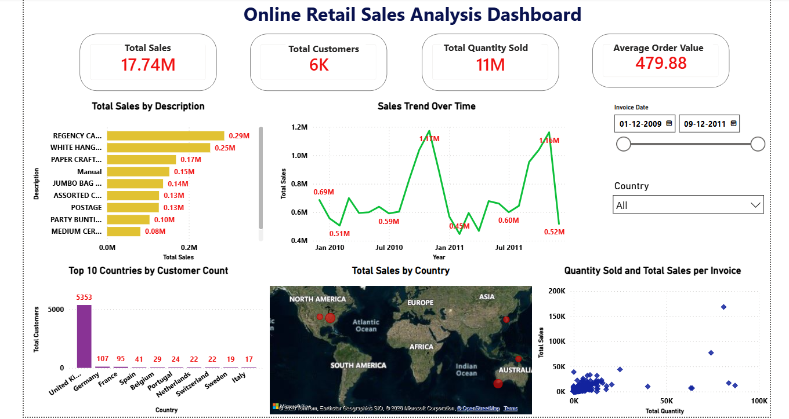
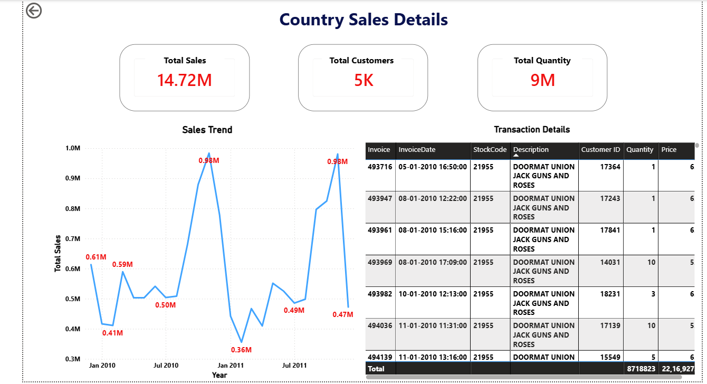

# Online Retail Sales Analysis

An interactive Power BI dashboard built to analyze online retail sales performance, customer activity, product sales, quantities sold, and country-level performance.

## Dashboard Overview

The dashboard provides an overview of key business metrics and allows users to interactively explore the data using date and country filters.

### Key Metrics
- Total Sales
- Total Customers
- Total Quantity Sold
- Average Order Value

### Visualizations
- Total Sales by Product Description
- Sales Trend Over Time
- Top 10 Countries by Customer Count
- Total Sales by Country
- Quantity Sold and Total Sales per Invoice
- Country-level Sales Details
- Transaction Details for selected countries

## Interactive Features

- Date range slicer to filter the dashboard by Invoice Date
- Country slicer for country-level analysis
- Interactive visuals that update based on selections
- Country Details page with detailed sales trends and transaction information

## Tools & Technologies

- Power BI
- DAX
- Power Query
- Data Modeling

## Project File

The Power BI dashboard file is available in this repository:

`Online_Retail_Sales_Analysis.pbix`

## Dashboard Preview

### Main Dashboard

### Country Sales Details

## Project Objective

The objective of this project is to demonstrate the use of Power BI for transforming retail data into an interactive dashboard and deriving useful insights from sales, customer, product, quantity, and country-level information.

## Key Insights

- The dashboard records total sales of 17.74M across approximately 6K customers.
- A total of 11M units were sold, with an average order value of 479.88.
- Sales performance varies over time, with noticeable peaks and declines across the analyzed period.
- The United Kingdom has the highest customer count among the countries shown in the Top 10 customer analysis.
- Country-level analysis helps identify differences in sales and customer activity across markets.
